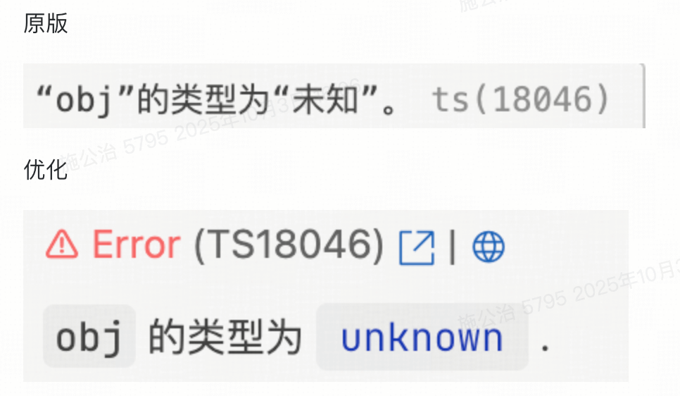
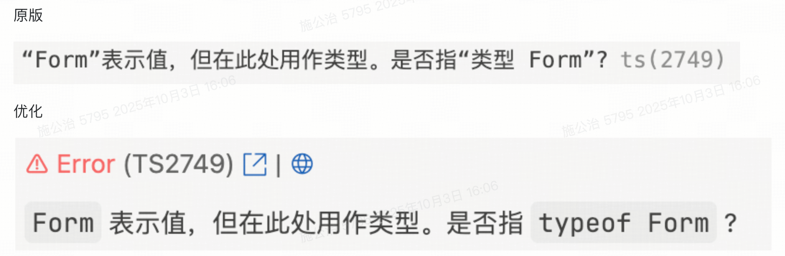
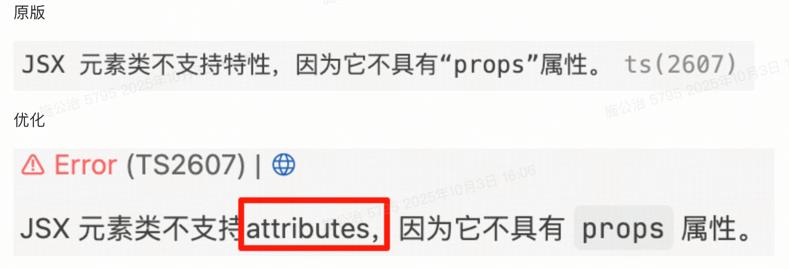
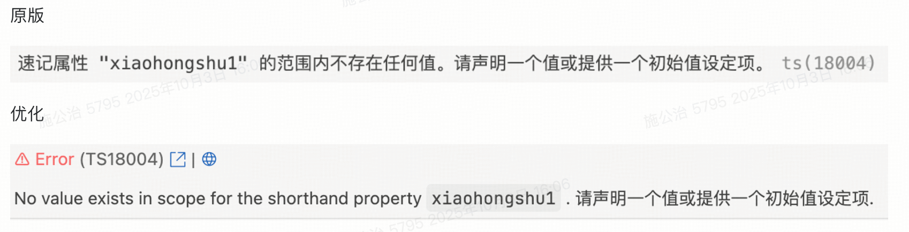

# 支持中文语境下更好地展示 ts 报错

settings.json 里添加如下配置，添加如下配置，添加如下配置

重要的事情说三遍

```json
"typescript.locale": "en",
```

若有翻译不完备的情况，可以评论区留言，给出示例代码及对应的展示截图，我会第一时间修复。

<div
  style="display: flex;gap: 10px;"
>
  <div>
    
    
  </div>
</div>

# 原始英文版插件的 bug 修复

<div>
  
</div>

# 中文原生不合理的翻译优化

<div
  style="display: flex;gap: 10px;"
>
  <div>
    
  </div>
  <div>
    
  </div>
  <div>
    
  </div>
</div>
<div
  style="display: flex;gap: 10px;"
>
  <div>
    
    
    
  </div>
</div>

# 隐藏原始报错

如何隐藏原始错误并使类型可复制
按照[那里的说明](https://github.com/yoavbls/pretty-ts-errors/blob/HEAD/docs/hide-original-errors.md)进行操作。不幸的是，由于 VSCode 的限制，需要进行此 hack。

上面给出的解决方案仍有部分原生报错无法避免，下面是更暴力的 CSS 解决方案，可以参考一下：
[CSS 文件](./z/pretty-ts-errors-hack.css)

在有 ts 报错的场景下，使用我推荐的 CSS 文件中可选的暴力样式，最好安装我的另一个插件，可以看一下，也很不错呦。[中文展示 eslint 规则提示，且美化展示效果](https://marketplace.visualstudio.com/items?itemName=SoulFriends.eslint-rules-zh-with-pretty)，附图

<div>
  
</div>
